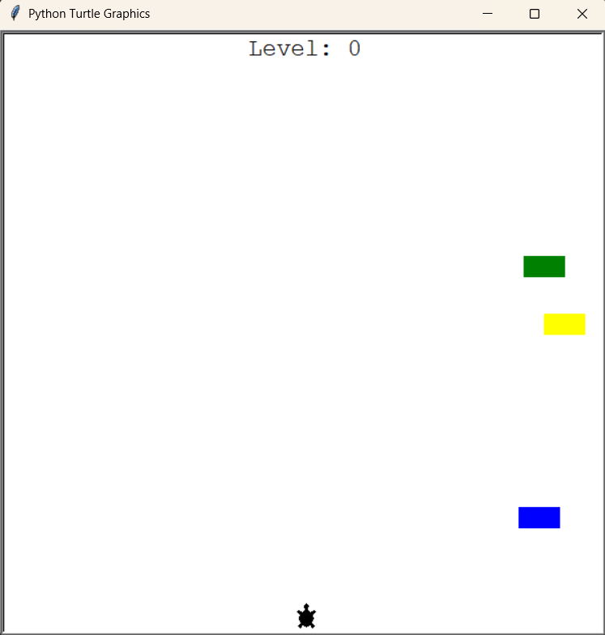
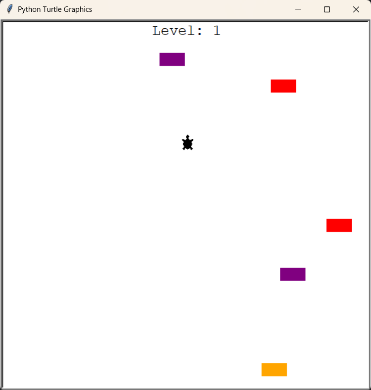
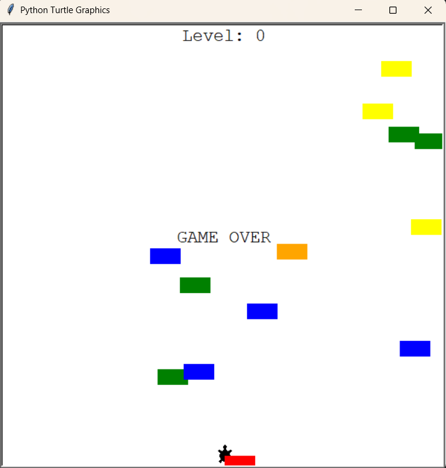

# 🐢 Turtle Crossing Game

Welcome to **Turtle Crossing**, a classic road-crossing game built in Python using the `turtle` graphics module.  
The objective is simple: guide your turtle safely across a busy street full of cars — level up and watch the traffic get faster!

---

## 🚀 Features

- 🏎️ **Dynamic Traffic:** Cars appear and move with increasing speed as you level up.
- 🐢 **Player Controls:** Use the **Up** arrow key to move the turtle forward.
- 🎮 **Collision Detection:** Collide with a car and it’s game over.
- 📈 **Scoreboard:** Displays your current level.
- ✅ **Clean Code:** Object-Oriented Design — clear separation of responsibilities.

---

## 📸 Showcase

| Gameplay | Level Up | Game Over |
|---| --- | --- |
|  |  |  |

---

## ⚙️ How to Run

1. **Install Python:**  
   ```bash
   python --version
Make sure you have Python 3.x installed.

2. **Clone or Download this Repository.**

3. **(Optional) Create a Virtual Environment:**
    ```bash
    python -m venv venv
# Activate:
## On macOS/Linux:
    source venv/bin/activate
## On Windows:
    venv\Scripts\activate

# Run the Game:
    python main.py
Play: Use the Up arrow key to move the turtle. Reach the top to level up — dodge cars to survive!

# 📂 Project Structure

    .
    ├── main.py
    ├── player.py
    ├── car_manager.py
    ├── scoreboard.py
    ├── images/
    │   ├── gameplay.png
    │   ├── level_up.png
    │   ├── game_over.png
    ├── videos/
    │   ├── gameplay.vlc
    └── README.md

## 👏 Credits
Built using Python’s turtle graphics module.
Inspired by the classic Frogger concept.

## 📄 License
Free to use for educational purposes. Fork, modify, and learn — just don’t sell it as your own commercial product.

## ✅ Happy Crossing!
May your turtle live long and cross many streets safely. 🚦🐢✨